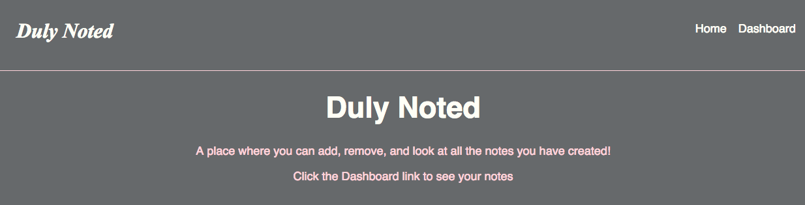
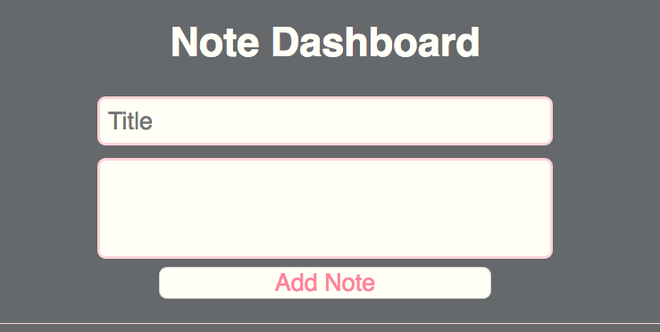
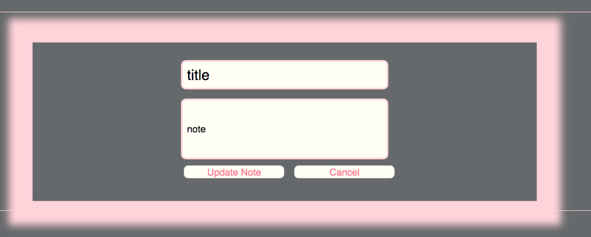
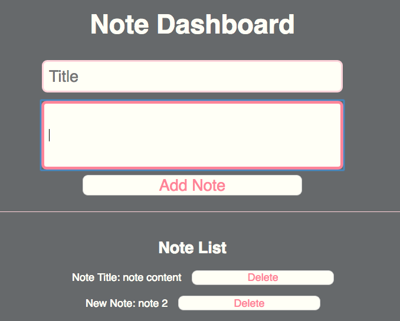

# 29 Component Composition

This is a note recording application with a home page route and a dashboard route. A user may review, create, update and delete notes from their dashboard page.

The home screen includes a navigation bar with links to the home page and dashboard, and a `landing` div with a welcome message.

Home Screen:



The dashboard includes a `note-create-form` div and a `note-list` div. The `note-create-form` div includes two input fields and a button to create a note and the `note-list` div lists the notes once they are created.

Create a note:



A note may be updated by double clicking on the note text, this will pop up a new form to enter updated information for that note. The user may also choose to cancel the update by clicking on the cancel button.

Update a note:



Each note has a `delete` button which will remove the note from the list.

Note list:



---

## Installing and Getting Started

To install, fork and git clone this repository to your local computer. Navigate to the `lab-melanie` directory in your terminal and type `npm i` to install all necessary dependencies. Be sure the `package.json` file includes the scripts:
```json
"scripts": {
    "build": "webpack",
    "watch": "webpack-dev-server --inline --hot"
}
```
Type `npm run watch` in the command line, then in your browser, go to `localhost:8080` and enjoy!

---

## Tests

This application includes two tests for the initial state of `./dashboard/index.js` and `./note-create-form/index.js`.
